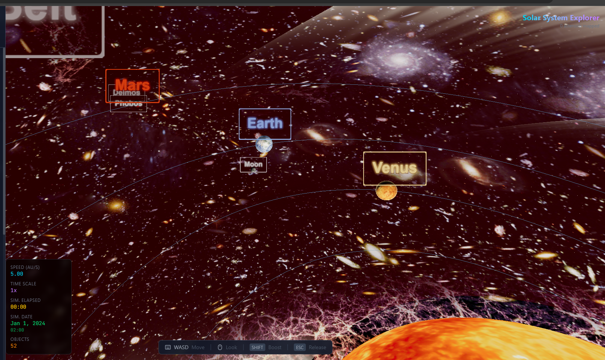
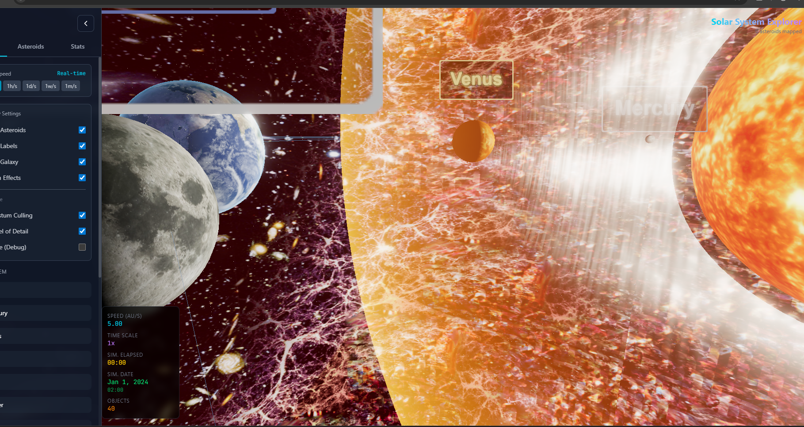

# Map The Solar System - Clean from Laggy Asteroids!

My own model of the solar system, galaxy and the multiverse!

## Previews:

Video Preview: https://vimeo.com/1180406387

Old version:

## Credits:

Burgil

## Planets Textures Credits:

Pablo Carlos Budassi created a dazzling logarithmic visualization of the observable universe in 2013. (Image credit: Pablo Carlos Budassi/Wikimedia Commons)

Earth textures: [PlanetPixelEmporium](https://planetpixelemporium.com/earth.html)

🖼️ Textures & Assets
Planet and sun textures were sourced from:
https://www.solarsystemscope.com/textures/
